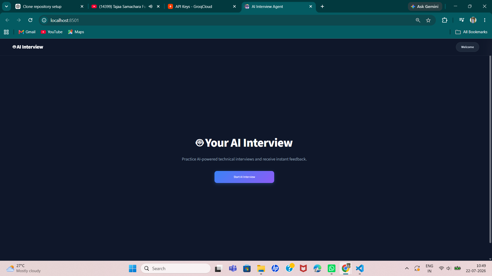
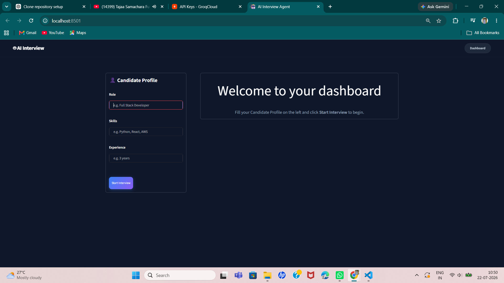
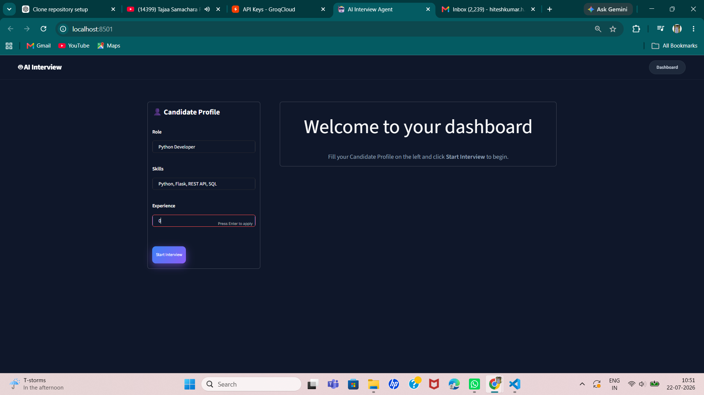
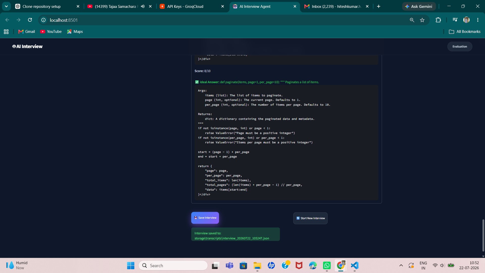

# 🤖 AI Interview Agent

An AI-powered technical interview platform built for the **Rooman AI Challenge**. The application generates role-specific interview questions, evaluates candidate responses using a Large Language Model (LLM), and provides detailed feedback with an overall performance report.

---

# 1. Project Overview

The **AI Interview Agent** is an intelligent interview preparation application designed to simulate a real-world technical interview experience. Based on a candidate's job role, technical skills, and experience level, the system generates personalized interview questions, evaluates submitted answers using the **Groq LLM API**, and produces a comprehensive performance report.

Built with **Python** and **Streamlit**, the application provides an interactive and user-friendly interface while maintaining a modular architecture for easy maintenance and future enhancements.

The project demonstrates the practical application of **Large Language Models (LLMs)**, prompt engineering, and AI-assisted evaluation to automate technical interviews and deliver instant, structured feedback.

---

# 2. Features

-  AI-generated interview questions based on candidate profile.
-  Candidate profile setup with role, skills, and experience.
-  Interactive interview session with one question at a time.
-  AI-powered answer evaluation using the Groq LLM.
-  Detailed interview report with:
  - Overall score
  - Question-wise evaluation
  - Strengths
  - Areas for improvement
  - Final recommendation
-  Manual interview transcript saving in JSON format.
-  Start a new interview without restarting the application.
-  Fast response generation using the Groq API.
-  Clean and responsive Streamlit user interface.
-  Secure API key management using environment variables.
-  Modular and scalable project architecture.

---

# 3. Tech Stack

| Category | Technology |
|----------|------------|
| **Programming Language** | Python 3.12 |
| **Frontend / UI** | Streamlit |
| **Large Language Model (LLM)** | Groq API |
| **Environment Management** | python-dotenv |
| **Data Storage** | JSON |
| **Version Control** | Git |
| **Repository Hosting** | GitHub |

### Core Libraries

- **Streamlit** – Interactive web application framework.
- **Groq SDK** – AI-powered question generation and answer evaluation.
- **python-dotenv** – Loads environment variables from a `.env` file.
- **JSON** – Stores manually saved interview transcripts.
- **OS** – Handles file and directory operations.
- **Datetime** – Generates timestamps for interview records.

### Development Tools

- Visual Studio Code
- Git
- GitHub
- Python Virtual Environment (`venv`)

# 4. Installation

Follow the steps below to set up and run the AI Interview Agent on your local machine.

## Prerequisites

Before installing the project, ensure you have the following installed:

- Python 3.12 or later
- Git
- A Groq API Key (available from the Groq Console)

---

## Step 1: Clone the Repository

```bash
git clone https://github.com/hiteshkumarh/rooman-interview-agent.git
```

---

## Step 2: Navigate to the Project Directory

```bash
cd rooman-interview-agent
```

---

## Step 3: Create a Virtual Environment

**Windows**

```bash
python -m venv .venv
```

**Linux / macOS**

```bash
python3 -m venv .venv
```

---

## Step 4: Activate the Virtual Environment

### Windows (PowerShell)

```powershell
.\.venv\Scripts\Activate
```

### Windows (Command Prompt)

```cmd
.venv\Scripts\activate.bat
```

### Linux / macOS

```bash
source .venv/bin/activate
```

After activation, your terminal should display:

```text
(.venv)
```

---

## Step 5: Install Dependencies

Install all required packages:

```bash
pip install -r requirements.txt
```

Wait until the installation completes successfully.

---

# 5. Environment Variables

This project uses **python-dotenv** to securely load environment variables from a `.env` file.

## Create a `.env` File

### Windows (PowerShell)

```powershell
New-Item .env -ItemType File
```

Or manually create a file named:

```text
notepad .env
```

Add your Groq API key:

```Notepad will open the file.
GROQ_API_KEY=your_groq_api_key_here
```

Replace `your_groq_api_key_here` with your actual Groq API key.

> **Important**
>
> - Never commit your `.env` file to GitHub.
> - Use the provided `.env.example` file as a reference.

---

# 6. Run the Project

Start the Streamlit application:

```bash
python -m streamlit run app.py
```

or

```bash
streamlit run app.py
```

Once the application starts successfully, Streamlit will display a URL similar to:

```text
Local URL: http://localhost:8501
```

Open the URL in your browser to access the AI Interview Agent.

To stop the application, press:

```text
Ctrl + C
```

---

# 7. Sample Input

Use the following sample profile to test the application.

| Field | Value |
|-------|-------|
| **Role** | Python Developer |
| **Skills** | Python, FastAPI, SQL, Git |
| **Experience** | Fresher |

### Example

```text
Role: Python Developer

Skills: Python, FastAPI, SQL, Git

Experience: Fresher
```

After entering the above details:

1. Click **Start Interview**.
2. Answer all AI-generated interview questions.
3. Submit your responses.
4. Review the evaluation report.
5. Click **Save Interview** to manually save the transcript (optional).

# 8. Project Structure

```text
rooman-interview-agent/
│
│   
│
├── config/
│   └── Application configuration files
│
├── llm/
│   ├── client.py
│   └── prompts.py
│
├── models/
│   └── Data models
│
├── services/
│   ├── evaluator.py
│   ├── interview_service.py
│   ├── question_generator.py
│   ├── report_generator.py
│   └── transcript_service.py
│
├── storage/
│   ├── json_storage.py
│   └── transcripts/
│
├── tests/
│   └── Test documentation
│
├── utils/
│   └── Utility functions
│
├── .env.example
├── .gitignore
├── app.py
├── README.md
├── requirements.txt
└── LICENSE (Optional)
```

## Folder Description

| Folder / File | Description |
|--------------|-------------|
| **app.py** | Entry point of the Streamlit application. Handles the user interface and interview workflow. |
| **llm/** | Contains the Groq client and prompt templates used for AI-powered question generation and answer evaluation. |
| **services/** | Implements the core business logic including interview management, evaluation, report generation, and transcript handling. |
| **storage/** | Stores interview transcripts in JSON format after manual saving. |
| **models/** | Contains data models used throughout the application. |
| **config/** | Stores application configuration files and settings. |
| **utils/** | Contains reusable helper functions and utility modules. |
| **assets/** | Stores static assets such as images and screenshots used by the project. |
| **tests/** | Contains test documentation and validation scenarios. |
| **requirements.txt** | Lists all required Python packages and dependencies. |
| **.env.example** | Sample environment variables required to run the application. |
| **README.md** | Project documentation including installation, usage, and project details. |
| **.gitignore** | Specifies files and directories that should not be tracked by Git. |

---

# 9. Usage

After launching the application, follow these steps to complete an interview.

## Step 1: Launch the Application

Run the application:

```bash
streamlit run app.py
```

Open the URL displayed in the terminal (usually):

```text
http://localhost:8501
```

---

## Step 2: Enter Candidate Details

Provide the following information:

- **Job Role**
- **Technical Skills**
- **Experience Level**

Example:

```text
Role: Python Developer
Skills: Python, FastAPI, SQL, Git
Experience: Fresher
```

---

## Step 3: Start the Interview

Click the **Start Interview** button.

The AI Interview Agent generates personalized technical interview questions based on the candidate profile.

---

## Step 4: Answer the Questions

- Read each question carefully.
- Enter your answer in the provided text area.
- Submit your response.
- Continue until all interview questions are completed.

---

## Step 5: Review the Evaluation Report

After completing the interview, the AI evaluates your responses and generates a report that includes:

- Overall Interview Score
- Question-wise Evaluation
- Strengths
- Areas for Improvement
- Final Recommendation

---

## Step 6: Save the Interview (Optional)

Click **Save Interview** to manually save the interview transcript.

The transcript is stored as a JSON file in:

```text
storage/transcripts/
```

---

## Step 7: Start a New Interview

Click **Start New Interview** to begin another interview session with a different candidate profile.

# 10. Screenshots

The following screenshots demonstrate the workflow of the AI Interview Agent.

## Landing Page



## Dashboard



## Fill for role,skills,Experience



## Evaluation Report



---

# 11. Design Decisions

The project was designed with simplicity, modularity, and scalability in mind.

### Modular Architecture

The application separates responsibilities into independent modules:

- **LLM Module** – Handles communication with the Groq API.
- **Question Generator** – Generates interview questions based on the candidate profile.
- **Evaluator** – Evaluates candidate responses using the LLM.
- **Report Generator** – Produces the final interview report.
- **Transcript Service** – Saves interview transcripts in JSON format.
- **Storage Layer** – Manages local transcript storage.

### Technology Choices

- **Python** was selected for its simplicity and extensive AI ecosystem.
- **Streamlit** enables rapid development of an interactive web interface.
- **Groq API** provides fast LLM inference for generating questions and evaluating answers.
- **JSON** storage was chosen for lightweight local persistence without requiring a database.
- **python-dotenv** securely manages API keys through environment variables.

### Design Trade-offs

- JSON storage keeps the project lightweight but is not suitable for large-scale deployments.
- The application currently supports only text-based interviews.
- Evaluation quality depends on the responses generated by the underlying LLM.
- A local file-based storage approach simplifies setup while sacrificing multi-user support.

---

# 12. Limitations

The current version of the AI Interview Agent has the following limitations:

- Requires an active internet connection to access the Groq API.
- Requires a valid Groq API key.
- Supports only text-based interviews.
- Interview transcripts are stored locally as JSON files.
- Does not include user authentication or profile management.
- Does not support real-time voice interviews.
- Currently optimized for single-user local execution.

---

# 13. Future Improvements

The following enhancements are planned for future versions:

-  Add voice-based interviews using Speech-to-Text and Text-to-Speech.
-  Support multilingual interviews.
-  Generate downloadable PDF interview reports.
-  Add interview analytics and performance tracking.
-  Implement user authentication and interview history.
-  Support adaptive follow-up questions based on previous answers.
-  Integrate PostgreSQL or MongoDB for persistent storage.
-  Deploy the application to a cloud platform.
-  Support multiple LLM providers such as Groq, OpenAI, and Gemini.
-  Develop an admin dashboard for monitoring interview statistics.

---

# 14. License

This project was developed as part of the **Rooman AI Challenge** for educational and demonstration purposes.

You are free to use, modify, and extend this project for learning and personal development.

---

## Author

**Hitesh Kumar H**

GitHub: https://github.com/hiteshkumarh

Built with ❤️ using **Python**, **Streamlit**, and the **Groq API**.
